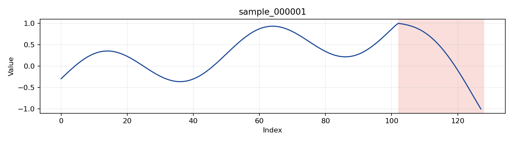

# Anomaly Synthesis Spec

## 1. Taxonomy

Base anomaly types from AnomLLM:

- `point`
- `freq`
- `trend`
- `range`

Variants:

- `trend`: `default`, `flat-trend`
- `point`, `freq`, `range`: `default`

`noisy-*` is not treated as a separate anomaly type. It is represented through background noise settings.

## 2. Principle

Use original generator parameter names whenever possible.

Target logic:

`parameter name -> verbal tag -> description template`

Do not introduce an extra naming layer such as `noise_level`, `frequency_band`, or `shift_strength` in the spec.

## 3. Parameter to Verbal Tag Mapping

### 3.1 `point`

Fixed params:

- `base_frequency = 0.03`
- `normal_duration_rate = 800 * scale`
- `anomaly_duration_rate = 30 * scale`
- `minimum_anomaly_duration = 5 * scale`
- `minimum_normal_duration = 200 * scale`

Verbal mapping:

| Parameter Name | Verbal Tag | Mapping |
| --- | --- | --- |
| `anomaly_std` | `strength` | `0.2 -> mild`, `0.5 -> obvious`, `0.8 -> strong` |
| fixed by type | `direction` | `becomes irregular` |

### 3.2 `freq`

Fixed params:

- `base_frequency = 0.03`
- `normal_duration_rate = 450 * scale`
- `anomaly_duration_rate = 15 * scale`
- `minimum_anomaly_duration = 7 * scale`
- `minimum_normal_duration = 20 * scale`

Verbal mapping:

| Parameter Name | Verbal Tag | Mapping |
| --- | --- | --- |
| `frequency_multiplier` | `strength` | `1.5 -> mild`, `2.0 -> obvious`, `3.0 -> strong` |
| `direction` | `direction` | `up -> faster`, `down -> slower` |

### 3.3 `trend`

Fixed params:

- `base_frequency = 0.02`
- `normal_duration_rate = 1700 * scale`
- `anomaly_duration_rate = 100 * scale`
- `minimum_anomaly_duration = 50 * scale`
- `minimum_normal_duration = 800 * scale`
- `normal_slope = 3.0`

Verbal mapping:

| Parameter Name | Verbal Tag | Mapping |
| --- | --- | --- |
| `abnormal_slope_range` | `strength` | `(4.5, 6.0) -> mild`, `(6.0, 12.0) -> obvious`, `(12.0, 20.0) -> strong` |
| `abnormal_slope` | `direction` | `abnormal_slope > normal_slope -> becomes steeper`, `abnormal_slope < 0 -> turns downward` |

Variant:

- `default`
- `flat-trend`

`flat-trend` uses:

- `abnormal_slope_range = (4.5, 6.0)`

### 3.4 `range`

Fixed params:

- `nominal_data_mean = 0.0`
- `nominal_data_std = 0.1`
- `normal_duration_rate = 800 * scale`
- `anomaly_duration_rate = 20 * scale`
- `minimum_anomaly_duration = 5 * scale`
- `minimum_normal_duration = 10 * scale`

Verbal mapping:

| Parameter Name | Verbal Tag | Mapping |
| --- | --- | --- |
| `anomaly_size_range` | `strength` | `(0.3, 0.45) -> mild`, `(0.5, 0.8) -> obvious`, `(0.8, 1.2) -> strong` |
| `direction` | `direction` | `up -> shifts upward`, `down -> shifts downward` |

## 4. Description Templates

Descriptions must:

- be in English
- mention the exact index range
- avoid ratio wording

Templates:

- `point`
  `A {strength} noise anomaly occurs from index {start} to {end}, and this segment becomes irregular.`
- `freq`
  `A {strength} frequency anomaly occurs from index {start} to {end}, and the oscillation becomes {direction}.`
- `trend`
  `A {strength} trend anomaly occurs from index {start} to {end}, and the local trend {direction}.`
- `range`
  `A {strength} level anomaly occurs from index {start} to {end}, and the segment {direction}.`

## 5. Example

Reference files:

- JSON: [docs/assets/example_sample.json](./assets/example_sample.json)
- Image: [docs/assets/example_sample.png](./assets/example_sample.png)

Image:



```json
{
  "sample_id": "sample_000001",
  "series": ["see example_sample.json"],
  "point_labels": ["see example_sample.json"],
  "parameters": {
    "anomaly_type": "trend",
    "variant": "default",
    "generator_model": {
      "base_frequency": 0.02,
      "normal_duration_rate": 217.6,
      "anomaly_duration_rate": 12.8,
      "minimum_anomaly_duration": 6,
      "minimum_normal_duration": 102,
      "normal_slope": 3.0,
      "abnormal_slope_range": [12.0, 20.0],
      "trend_mode": "reverse_down",
      "variant": "default"
    }
  },
  "events": [
    {
      "start": 102,
      "end": 128,
      "type": "trend",
      "raw_params": {
        "start": 102,
        "end": 128,
        "abnormal_slope_range": [12.0, 20.0],
        "normal_slope": 3.0,
        "abnormal_slope": -18.164267732816153
      },
      "verbal_tags": {
        "strength": "strong",
        "direction": "turns downward"
      },
      "description": "A strong trend anomaly occurs from index 102 to 128, and the local trend turns downward."
    }
  ],
  "context": {
    "background_noise": "light",
    "series_length": 128,
    "sampling_regime": "regular",
    "source_model": "AnomLLM-derived"
  }
}
```
